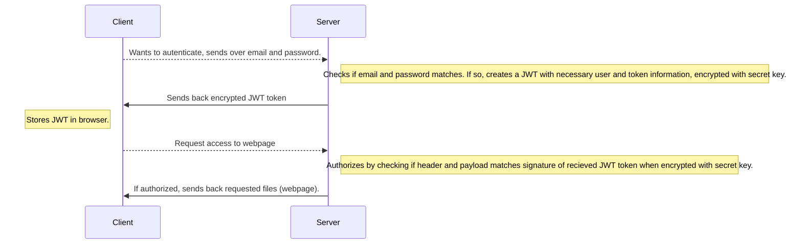
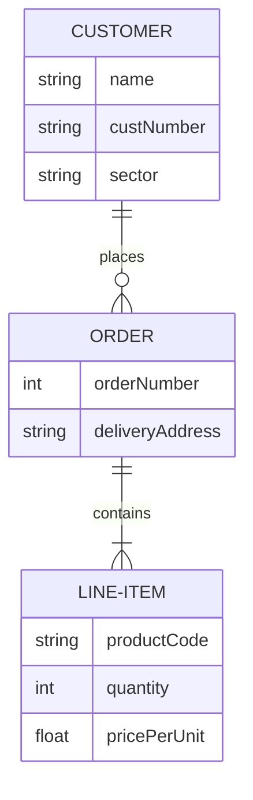

# Git playground
## Diagram JWT

```javascript
let num = 7;
```

```JAVA
float decimal = 0.5;
```


[Visit google](https://www.google.com)

|Headline|Headline|
|---|---|
|Text|Text|
|Text|Text|

**This is** bold and *this is* italic

:star: Gold star

---

Horizontal line above

- Item 1
- Item 2
- Item 3

> This is a blockquote



```mermaid
classDiagram
    Animal <|-- Duck
    Animal <|-- Fish
    Animal <|-- Zebra
    Animal : +int age
    Animal : +String gender
    Animal: +isMammal()
    Animal: +mate()
    class Duck{
        +String beakColor
        +swim()
        +quack()
    }
    class Fish{
        -int sizeInFeet
        -canEat()
    }
    class Zebra{
        +bool is_wild
        +run()
    }
 ```

`This` is a highlighted word.

```mermaid
sequenceDiagram
    Alice->>John: Hello John, how are you?
    John-->>Alice: Great!
    Alice-)John: See you later!
```

